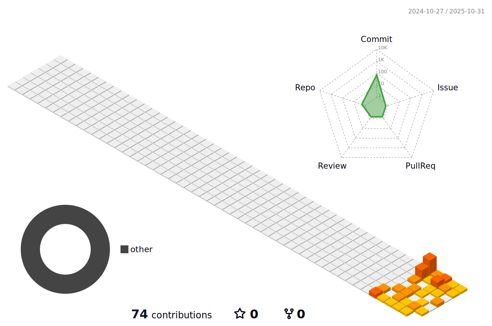

  

<!-- 标题 + 个人描述, emoji 取自: http://emojihomepage.com -->

  <h1 height="200px" align="center">
    God dag , I'm Mr.Zhang
  </h1>
  
A Sometimes 10x developer 🚀 and sometimes "it works on my machine" guy 🤷‍♂️ full stack developer from China 🇨🇳

 

## 📈Statistics

<!-- 贪吃蛇, 由工作流定时生成 -->
<picture>
  <source media="(prefers-color-scheme: dark)" srcset="./assets/github-snake-dark.svg" />
  <source media="(prefers-color-scheme: light)" srcset="./assets/github-snake.svg" />
  
</picture>

 

|  |  |
| ------------- | ------------- |

 

    

 

    

 
 

<!-- 半年日历, 由工作流定时生成 -->
<!--  -->

<!-- #### Top Repositories

 -->

